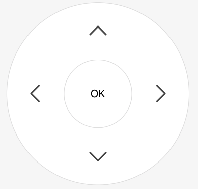
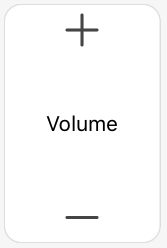

# FoolsparadiseView  
原 Repository name 是 iOSUIViewKit ，现改为 FoolsparadiseView  

## Before Use , Preparation  
- [Masonry](https://github.com/SnapKit/Masonry) or [i forked Masonry](https://github.com/foolsparadise/Masonry). Donnot worry, its same one.  
  

## Howto  
import FoolsparadiseView.h and use...  

#### AlertWith1inputTextFieldView preview  
  
#### Usage  
```  
#import "AlertWith1inputTextFieldView.h"  
  
<AlertWith1inputTextFieldViewDelegate>  
  
AlertWith1inputTextFieldView *centerAlertInputView ;  
centerAlertInputView = [[AlertWith1inputTextFieldView alloc] initWithFrame:CGRectMake(0, 100, [UIScreen mainScreen].bounds.size.width, 140)];  
centerAlertInputView.titleAlertString = NSLocalizedStringFromTable(@"Please Input Your Nickname:", @"InfoPlist", nil);  
centerAlertInputView.leftShowString = NSLocalizedStringFromTable(@"Your Nickname", @"InfoPlist", nil);  
centerAlertInputView.rightButtonString = NSLocalizedStringFromTable(@"OK", @"InfoPlist", nil);  
centerAlertInputView.delegate = self;  
centerAlertInputView.tag = tag;  
[self.view addSubview:centerAlertInputView];  
[centerAlertInputView mas_makeConstraints:^(MASConstraintMaker *make) {  
    make.top.mas_equalTo(self.view.mas_top).mas_offset(100);  
    make.left.mas_equalTo(self.view.mas_left).mas_offset(0);  
    make.size.mas_equalTo(CGSizeMake(SCREEN_WIDTH, 140));  
}];  
  
//Delegate  
- (void)AlertWith1inputTextFieldViewDelegate:(NSInteger)ClickedTag withInputString:(NSString *)InputString  
{  
    NSLog(@"%s click %ld %@", __func__, (long)ClickedTag, InputString);  
    if(InputString.length<=0) {  
        //No Input  
        return;  
    }  
    __weak typeof(self) weakSelf = self;  
    // ClickedTag view' tag  
    if(ClickedTag==1) { }  
}  
```      
  
### AlertWith2ButtonView preview  
  
### Usage  
```  
#import "AlertWith2ButtonView.h"  
  
<AlertWith2ButtonViewDelegate>  
  
AlertWith2ButtonView *centerAlertView;  
centerAlertView = [[AlertWith2ButtonView alloc] initWithFrame:CGRectMake(0, 100, [UIScreen mainScreen].bounds.size.width, 140)];      
centerAlertView.titleAlertString = NSLocalizedStringFromTable(@"Are you sure use foolsparadise/FoolsparadiseView ?", @"InfoPlist", nil);  
centerAlertView.leftButtonString = NSLocalizedStringFromTable(@"NO", @"InfoPlist", nil);  
centerAlertView.rightButtonString = NSLocalizedStringFromTable(@"Yes", @"InfoPlist", nil);  
centerAlertView.delegate = self;  
centerAlertView.tag = tag;  
[self.view addSubview:centerAlertView];  
[centerAlertView mas_makeConstraints:^(MASConstraintMaker *make) {  
    make.top.mas_equalTo(self.view.mas_top).mas_offset(100);  
    make.left.mas_equalTo(self.view.mas_left).mas_offset(0);  
    make.size.mas_equalTo(CGSizeMake(SCREEN_WIDTH, 140));  
}];  
  
//Delegate    
- (void)AlertWith2ButtonViewDelegate:(NSInteger)ClickedTag withButtonTag:(NSInteger)ButtonTag  
{  
    NSLog(@"%s click %ld %ld", __func__, (long)ClickedTag, (long)ButtonTag);  
    __weak typeof(self) weakSelf = self;  
    // ClickedTag view' tag  
    // ButtonTag 1:left 2:right  
    if(ClickedTag==1) {  
        if(ButtonTag==1) { }  
        else { }  
    }  
}  
```  
  
### AnimationLoadingView preview  
  
### Usage  
```  
#import "AnimationLoadingView.h"  
  
AnimationLoadingView *centerAnimationView;  
  
centerAnimationView = [[AnimationLoadingView alloc] initWithFrame:CGRectMake(0, 0, 174, 150)];  
centerAnimationView.msgShowString = @"Do some interesting things !";  
[weakSelf.view addSubview:centerAnimationView];  
[centerAnimationView mas_makeConstraints:^(MASConstraintMaker *make) {  
    make.centerX.mas_equalTo(weakSelf.view.mas_centerX).mas_offset(0);  
    make.centerY.mas_equalTo(weakSelf.view.mas_centerY).mas_offset(0);  
    make.size.mas_equalTo(CGSizeMake(174, 150));  
}];  

```  
  
### Round5WithMultiGestureView preview  
   
### Usage    
```  
#import "Round5WithMultiGestureView.h"  
  
<Round5WithMultiGestureViewDelegate>  
  
@property (nonatomic, strong) Round5WithMultiGestureView * Round5Button;  
  
[self.view addSubview:self.Round5Button];  
[self.Round5Button mas_makeConstraints:^(MASConstraintMaker *make) {  
    make.top.mas_equalTo(self.view.top).mas_offset(348.5);  
    make.size.mas_equalTo(CGSizeMake(240, 240));  
    make.centerX.mas_equalTo(self.view.mas_centerX).mas_offset(0);  
}];  
  
-(Round5WithMultiGestureView *)Round5Button  
{  
    if (!_Round5Button) {  
        _Round5Button = [[Round5WithMultiGestureView alloc] initWithFrame:CGRectMake(67.5, 348.5, 240, 240)];  
        _Round5Button.upImageViewString = @"MultiGestureView_top";  
        _Round5Button.leftImageViewString = @"MultiGestureView_left";  
        _Round5Button.middleLableString = @"OK";  
        _Round5Button.rightImageViewString = @"MultiGestureView_right";  
        _Round5Button.downImageViewString = @"MultiGestureView_bottom";  
        _Round5Button.delegate = self;  
        _Round5Button.tag = 1;  
    }  
    return _Round5Button;  
}  
- (void)Round5WithMultiGestureViewDelegate:(NSInteger)ClickedTag withButtonTag:(NSInteger)ButtonTag  
{  
    NSLog(@"%s click %ld %ld", __func__, (long)ClickedTag, (long)ButtonTag);  
    // ClickedTag : view tag
    // ButtonTag 0:centel OK btn 1:top 2:left 3:right 4:bottom 
}  
```  
### Square3WithMultiGestureView preview  
  
### Usage    
```  
#import "Square3WithMultiGestureView.h"  
  
<Square3WithMultiGestureViewDelegate>  
  
@property (nonatomic, strong) Square3WithMultiGestureView * Square3Button;  
  
[self.view addSubview:self.Square3Button];  
[self.Square3Button mas_makeConstraints:^(MASConstraintMaker *make) {  
    make.top.mas_equalTo(self.view.top).mas_offset(165);  
    make.size.mas_equalTo(CGSizeMake(105, 160));  
    make.centerX.mas_equalTo(self.view.mas_centerX).mas_offset(-105-20);  
}];  

-(Square3WithMultiGestureView *)Square3Button  
{  
    if (!_Square3Button) {  
        _Square3Button = [[Square3WithMultiGestureView alloc] initWithFrame:CGRectMake(10, 165, 105, 160)];  
        _Square3Button.upImageViewString = @"MultiGestureView_plus";  
        _Square3Button.middleLableString = @"Volume";  
        _Square3Button.downImageViewString = @"MultiGestureView_minus";  
        _Square3Button.delegate = self;  
        _Square3Button.tag = 1;  
    }  
    return _Square3Button;  
}  
- (void)Square3WithMultiGestureViewDelegate:(NSInteger)ClickedTag withButtonTag:(NSInteger)ButtonTag  
{  
    NSLog(@"%s click %ld %ld", __func__, (long)ClickedTag, (long)ButtonTag);  
    // ClickedTag : view tag  
    // ButtonTag 1:top 2:bottom  
}  
```  
  
## Round5WithMultiGestureView and Square3WithMultiGestureView 3rd  
```  
/**  
 #超出响应区域无法响应相关的事件  
 对于iOS的点击事件来说如果点击的区域超出了其本身的视图大小和其父视图的大小，是不会响应这个点击事件的，这个特性对于UIControl, UIButton, UITapGestureRecognizer, UILongPressGestureRecognizer, UISwipeGestureRecognizer等响应点击事件的控件或手势来说是很重要的，只要控件或手势超出了其本身的大小和其父视图的大小，那就不会响应点击事件。  
   
 #超出响应区域仍能继续响应相关的事件  
 但是对于滑动手势如:UIPanGestureRecognizer, UIRotationGestureRecognizer, UIPinchGestureRecognizer手势来说超出其本身大小和其父视图的大小后仍能响应滑动事件。  
 */  
  
- (void)viewDidLoad {  
    [super viewDidLoad];  
      
    UIView *panGestureView = [UIView new];  
    panGestureView.backgroundColor = [UIColor cyanColor];  
    [self.view addSubview:panGestureView];  
    CGRect frame = (CGRect){100, 100, 200, 200};  
    panGestureView.frame = frame;  
      
    //UITapGestureRecognizer //点击  
    //UILongPressGestureRecognizer //长按  
    //UISwipeGestureRecognizer  
    //UIPanGestureRecognizer //滑动  
    //UIRotationGestureRecognizer  
    //UIPinchGestureRecognizer  
      
    UIPanGestureRecognizer *panGesture = [[UIPanGestureRecognizer alloc] initWithTarget:self action:@selector(panGesture:)];  
    [panGestureView addGestureRecognizer:panGesture];  
}  
  
- (void)panGesture:(UIGestureRecognizer *)gesture{  
      
    CGPoint point = [gesture locationInView:gesture.view];  
    NSLog(@"point is %@", NSStringFromCGPoint(point));  
}  
  
```    
### TopImage_BottomTitleLabel_ContentCenter_Button  
### Usage  
```
__weak typeof(self) weakSelf = self;
TopImage_BottomTitleLabel_ContentCenter_Button *btn = [TopImage_BottomTitleLabel_ContentCenter_Button new];
btn.tag=0;
[btn addTarget:self action:@selector(ClickedRecord) forControlEvents:UIControlEventTouchUpInside];
[self.view addSubview:btn];
[btn mas_makeConstraints:^(MASConstraintMaker *make) {
    make.bottom.mas_equalTo(weakSelf.view.mas_bottom).mas_offset(0);
    make.centerX.mas_equalTo(weakSelf.view.mas_centerX).mas_offset(0);
    //make.size.mas_equalTo(CGSizeMake(68, 68));
    make.size.mas_equalTo(CGSizeMake(120, 120));
}];
[btn configureheightSpace:26 withTitle:@"bottom_label_text" withImageNamed:@"top_image_name"];
```

### ToDo:精简代码  

### MIT  
  

  
